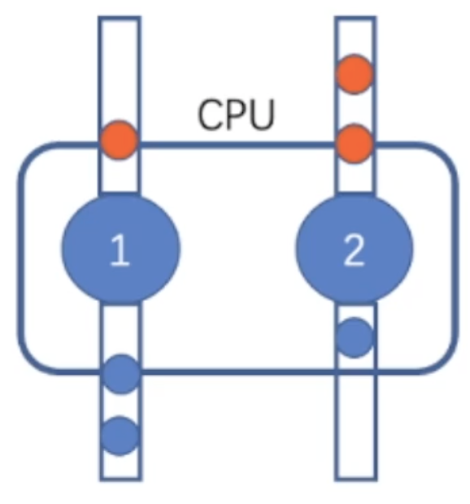
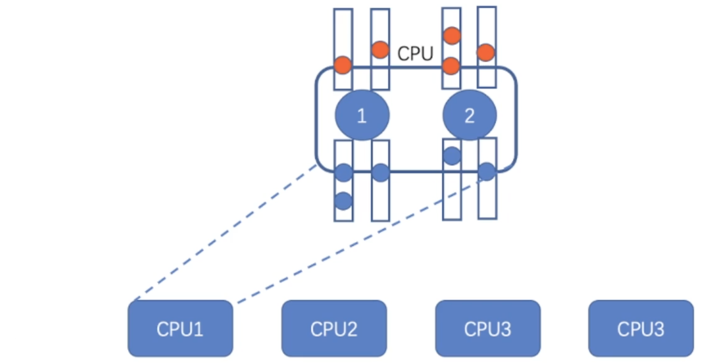
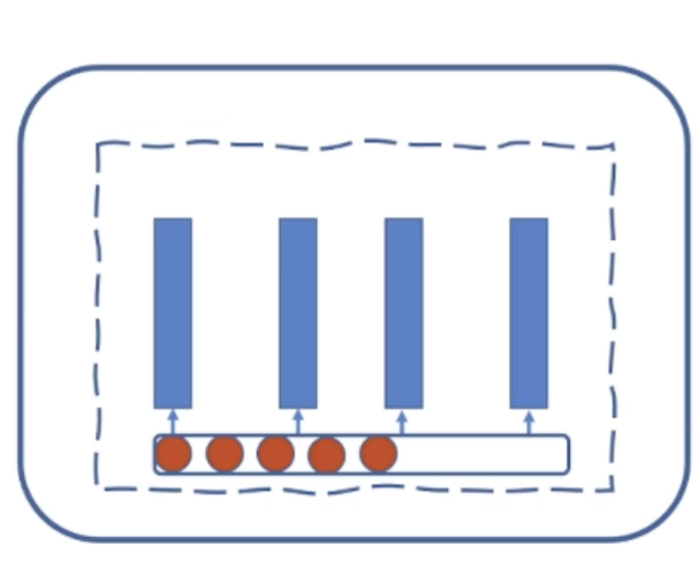

# Task-Queue

## 1. Implementation

**implementation of circular queue**

```cpp
#include <iostream>
#include <vector>
using namespace std;
class Queue{
public:
    Queue(int n = 5) : arr(n), head(0), tail(0), cnt(0) {}
    void push(int val) {
        if (IsFull()) {
            cout << "Cannot push, IsFull" << endl;
            return ;
        }
        arr[tail] = val;
        tail += 1;
        cnt += 1;
        if (tail == arr.size()) tail = 0;
        return ;
    }
    void pop() {
        if (IsEmpty()) {
            cout << "Cannot pop, IsEmpty" << endl;
            return ;
        }
        head += 1;
        cnt -= 1;
        if(head == arr.size()) head = 0;
        return ;
    }
    bool IsEmpty() {
        return cnt == 0;
    }
    bool IsFull() {
        return cnt == arr.size();
    }
    void output() {
        for (int i = 0, h = head; i < cnt; i++) {
            cout << arr[h] << " ";
            h += 1;
            if (h == arr.size()) h = 0;
        }
        cout << endl;
        return ;
    }
    void clear() {
        head = tail = cnt = 0;
        return ;
    }
private:
    int head, tail, cnt;
    vector<int> arr;
};


int main() {
    string op;
    int value;
    Queue queue;
    while (cin >> op) {
        if (op == "push") {
            cin >> value;
            queue.push(value);
        } else if (op == "pop") {
            queue.pop();
        }
        queue.output();
    }
    return 0;
}
```


## 2. Application Scenarios

* CPU Hyper-Threading Technology

  

  
* Task queues for thread pools

  