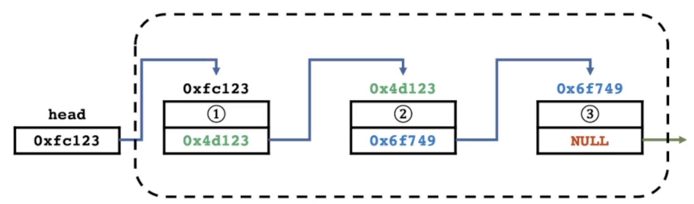
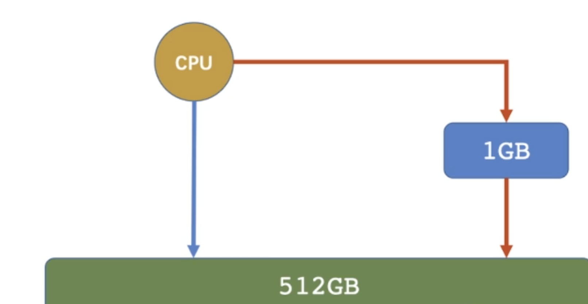

# List



## 1. Characteristics

1. Linked list consists of two parts: Data field and Pointer field.
2. time complexity: search O(n), insert O(1), delete O(1).

## 2. Implementation

**The first way to implement**

```cpp
#include <iostream>
using namespace std;
struct Node{
	Node(int n) : data(n), next(nullptr) {}
	int data;
	Node* next;
};

int main() {
	Node *head;
	head = new Node(1);
	head->next = new Node(2);
	head->next->next = new Node(3);
	head->next->next->next = new Node(4);
	Node *p = head;
	while (p) {
		cout << p->data << "-->";
		p = p->next;
	}
	cout << "nullptr" << endl;
	return 0;
}
```

**The second way to implement**

```cpp
#include <iostream>
using namespace std;

int data[10], nxt[10];

void add(int ind, int p, int val) {
	nxt[p] = nxt[ind];
	nxt[ind] = p;
	data[p] = val;
	return ;
}

int main() {
	int ind = 3;
	data[3] = 4;
	add(3, 5, 12);
	add(3, 4, 13);
	add(5, 6, 15);
	add(4, 7, 17);
	int p = ind;
	while (p) {
		cout << data[p] << "-->";
		p = nxt[p];
	}
	cout << "nullptr" << endl;
	return 0;
}
```

## 3. Application Scenarios

* Dynamic memory allocation within the operating system

  

  
* LRU cache algorithm

  