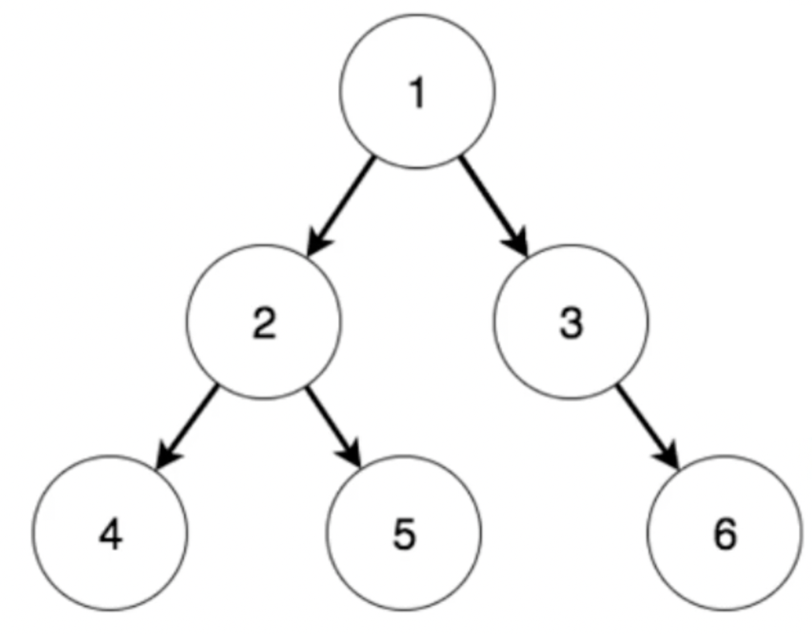
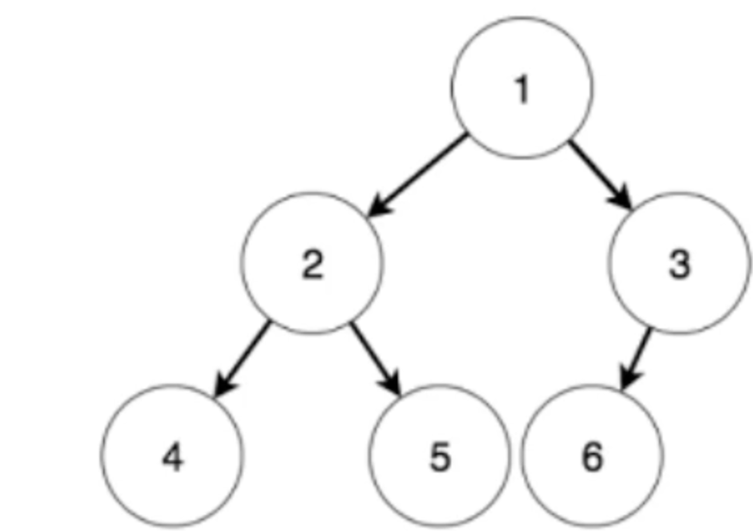
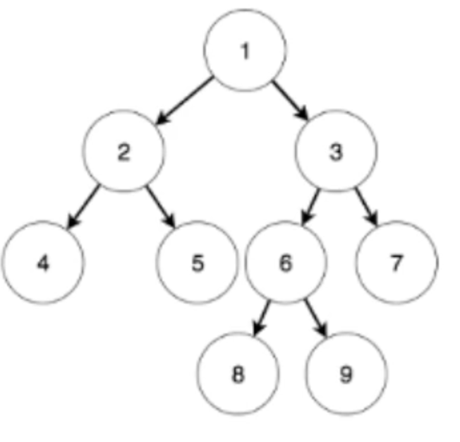
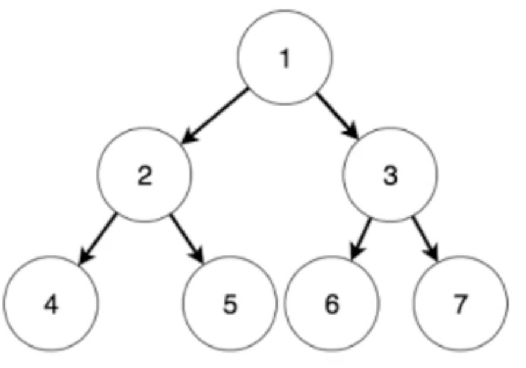

# Binary-Tree

## 1. Characteristics



1. List is a special tree.
2. The number of nodes is one more than the number of edges.
3. Nodes with degree 0 have one more node than those with degree 2.

***Node: Set, Edge: Relation***

## 2. Implementation

```cpp
#include <iostream>
using namespace std;

struct Node{
    Node(int n = 0, Node* l = nullptr, Node* r = nullptr) : val(n), lchild(l), rchild(r) {}
    int val;
    Node *lchild, *rchild;
};

Node* RandomInsert(Node* root, int val) {
    if (!root) return new Node(val);
    if (rand() % 2) {
        root->lchild = RandomInsert(root->lchild, val);
    } else {
        root->rchild = RandomInsert(root->rchild, val);
    }
    return root;
}

void PreOrder(Node* root) {
    if (!root) return ;
    cout << root->val << " ";
    PreOrder(root->lchild);
    PreOrder(root->rchild);
    return ;
}

void Clean(Node* root) {
    if (!root) return ;
    Clean(root->lchild);
    Clean(root->rchild);
    delete(root);
    return ;
}

int main() {
    srand(time(0));
    int n;
    cin >> n;
    Node* root = nullptr;
    for (int i = 1; i < n + 1; i++) root = RandomInsert(root, i);
    PreOrder(root);
    cout << endl;
    Clean(root);
    return 0;
}
```

## 3. Types

### complete binary tree



### full binary tree



***root : number i, root->left: 2 \* i, root->right: 2 \* i + 1***

### perfect binary tree

