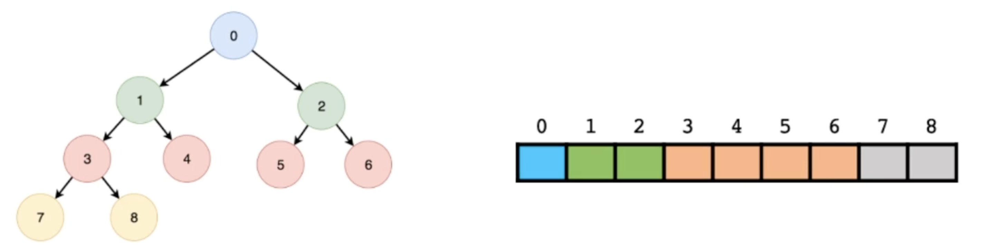
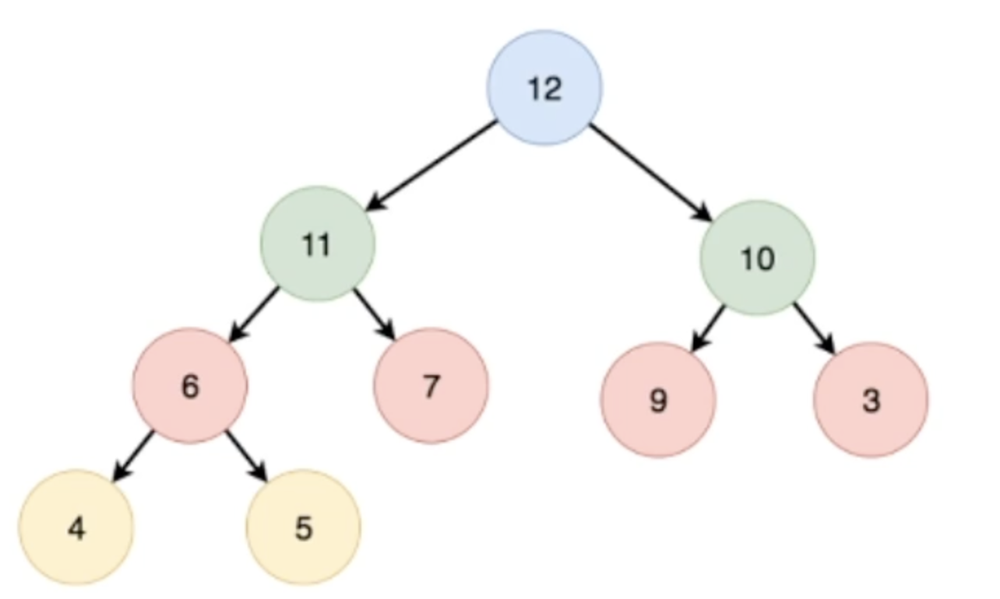
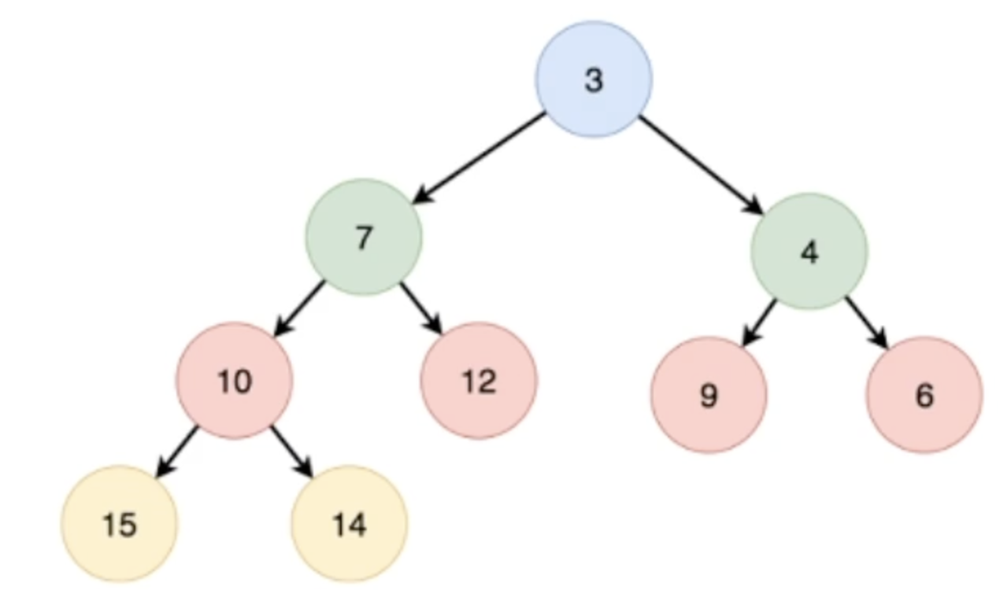

# Heap

## 1. complete binary tree



## 2. Characteristics(Heap)

***Heap is a complete binary tree***

***Heap is an implementation of a priority queue.***



***max heap***

The value of the parent node is greater than the value of the child node.



***min heap***

The value of the parent node is less than the value of the child node.

## 3. Implementation

### version 1

```cpp
#include <iostream>
using namespace std;

class Heap{
public:
    void shift_up(int ind) {
        while (ind && data[(ind - 1) / 2] < data[ind]) {
            swap(data[(ind - 1) / 2], data[ind]);
            ind = (ind - 1) / 2;
        }
        return ;
    }
    void shift_down(int ind) {
        int n = cnt - 1;
        while (ind * 2 + 1 <= n) {
            int temp = ind;
            if (data[ind] < data[ind * 2 + 1]) temp = ind * 2 + 1;
            if (ind * 2 + 2 <= n && data[temp] < data[ind * 2 + 2]) temp = ind * 2 + 2;
            if (temp == ind) break;
            swap(data[temp], data[ind]);
            ind = temp;
        }
        return ;
    }
    void push(int val) {
        data[cnt++] = val;
        ind++;
        shift_up(cnt - 1);
        return ;
    }
    void pop() {
        if (Getsize() == 0) return ;
        cnt--;
        swap(data[0], data[cnt]);
        shift_down(0);
        return ;
    }
    int top() {
        if (Getsize() == 0) return -1;
        return data[0];
    }
    int Getsize() {return cnt;}
    void SortValue(int n) {
        //cout << "=========================" << endl;
        //cout << "first" << n << "heap : " << endl;
        for (int i = 0; i < n; i++) cout << data[i] << " ";
        cout << endl;
        //cout << "=========================" << endl;
        return ;
    }
    int Getind() {return ind;}
private:
    int data[100] = {0}, cnt = 0, ind = 0;
};


int main() {
    int op, val, cnt, ind;
    Heap heap;
    while (cin >> op) {
        switch (op) {
            case 0: {
                cin >> val;
                cout << "push val : " << val << endl;
                heap.push(val);
            } break;
            case 1: {
                cout << "pop val :" << heap.top() << endl;
                heap.pop();
            } break;
        }
        cnt = heap.Getsize(), ind = heap.Getind();
        cout << "valid part" << endl;
        heap.SortValue(cnt);
        cout << "all part" << endl;
        heap.SortValue(ind);
    }
    return 0;
}
```

### version 2

```cpp
template<typename T>
class Heap : public vector<T> {
public:
    template<typename Func_T>
    Heap(Func_T cmp) : cmp(cmp) {}
    void push(const T &a) {
        this->push_back(a);
        push_heap(this->begin(), this->end(), cmp);
        return;
}
    void pop() {
        pop_heap(this->begin(), this->end(), cmp);
        this->pop_back();
        return;
}
    T &top() { return this->at(0); }
private:
    function<bool(T, T)> cmp;
};
//Heap<int> h{less<int>()};
//Heap<int> h{greater<int>()};
```

### version 3

```cpp
#include <iostream>
#include <vector>
#include <algorithm>
using namespace std;
void printVec(vector<int> nums)
{
    for (int i = 0; i < nums.size(); ++i)
        cout << nums[i] << " ";
    cout << endl;
}

int main() {
    vector<int> v{3, 5, 8, 2};
    make_heap(v.begin(), v.end(), less<int>()); // establish a heap base on vector
    printVec(v);
    v.push_back(12); // push a value to heap
    push_heap(v.begin(), v.end(), less<int>()); // adjust heap
    printVec(v);
    pop_heap(v.begin(), v.end(), less<int>()); //pop from heap (swap it with the end of vector)
    v.pop_back(); //pop biggest or smallest one.
    printVec(v);
    return 0;
}
```

### version 4

```cpp
#include <iostream>
#include <algorithm>
#include <string>
#include <cstring>
#include <queue>
using namespace std;

int main() {
    priority_queue<int, vector<int>, greater<int>> min_h;
    priority_queue<int> max_h;
    max_h.push(4);
    max_h.push(2);
    max_h.push(3);
    max_h.push(7);
    max_h.push(6);
    while (max_h.size()) {
        cout << max_h.top() << endl;
        max_h.pop();
    }

    return 0;
}
```