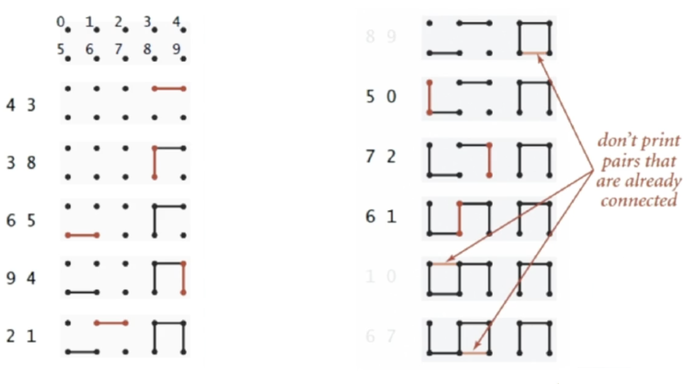

# Union-find

## 1. Connectivity problems



## 2. Implementation

### Standard - Quick-Union with Path compression

```cpp
class UnionSet{
public:
    int *boss, n;
    UnionSet(int n) :n(n) {
        boss = new int[n + 1];
        for (int i = 0; i <= n; i++) boss[i] = i;
    }
    int get(int x) {
        return boss[x] = (boss[x] == x ? x : get(boss[x]));
    }
    void merge(int a, int b) {
        boss[get(a)] = get(b);
        return ;
    }
};
```

### Quick-Find

```cpp
class UnionSet{
public:
    int *color, n;
    UnionSet(int val) : n(val) {
        color = new int[n + 1];
        for (int i = 0; i <= n; i++) color[i] = i;
    }
    int find(int x) {
        return color[x];
    }
    void merge(int x, int y) {
        int cx = color[x], cy = color[y];
        if (cx == cy) return ;
        for (int i = 0; i <= n; i++) {
            if (color[i] == cx) color[i] = cy;
        }
        return ;
    }

};
```

### Quick-Union

```cpp
class UnionSet{
public:
    int *boss, n;
    UnionSet(int n) :n(n) {
        boss = new int[n + 1];
        for (int i = 0; i <= n; i++) boss[i] = i;
    }
    int find(int x) {
        if (boss[x] == x) return x;
        return find(boss[x]);
    }
    void merge(int a, int b) {
        int fa = find(a), fb = find(b);
        if (fa == fb) return ;
        boss[fa] = fb;
        return ;
    }
};
```

### Weighted_Quick-Union

```cpp
class UnionSet{
public:
    int *boss, *cnt, n;
    UnionSet(int n) :n(n) {
        boss = new int[n + 1];
        cnt = new int[n + 1];
        for (int i = 0; i <= n; i++) {
            boss[i] = i;
            cnt[i] = 1;
        }
    }
    int find(int x) {
        if (boss[x] == x) return x;
        return find(boss[x]);
    }
    void merge(int a, int b) {
        int fa = find(a), fb = find(b);
        if (cnt[fa] < cnt[fb]) {
            boss[fa] = fb;
            cnt[fb] += cnt[fa];
        } else {
            boss[fb] = fa;
            cnt[fa] += cnt[fb];
        }
        return ;
    }
};
```

### Weighted_Quick-Union with Path Compression

```cpp
class UnionSet{
public:
    int *boss, *cnt, n;
    UnionSet(int n) :n(n) {
        boss = new int[n + 1];
        cnt = new int[n + 1];
        for (int i = 0; i <= n; i++) {
            boss[i] = i;
            cnt[i] = 1;
        }
    }
    int find(int x) {
        if (boss[x] == x) return x;
        int root = find(boss[x]);
        boss[x] = root;
        return root;
    }
    void merge(int a, int b) {
        int fa = find(a), fb = find(b);
        if (cnt[fa] < cnt[fb]) {
            boss[fa] = fb;
            cnt[fb] += cnt[fa];
        } else {
            boss[fb] = fa;
            cnt[fa] += cnt[fb];
        }
        return ;
    }
};
```

## 3. Time Complexity

