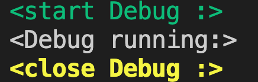

## 1. build "color.h"

```cpp
#ifndef _COLOR_H
#define _COLOR_H
#define NONE  "\e[0m"
#define BLACK  "\e[0;30m"
#define L_BLACK  "\e[1;30m"
#define RED   "\e[0;31m"
#define L_RED  "\e[1;31m"
#define GREEN  "\e[0;32m"
#define L_GREEN   "\e[1;32m"
#define BROWN "\e[0;33m"
#define YELLOW "\e[1;33m"
#define BLUE "\e[0;34m"
#define L_BLUE "\e[1;34m"
#define PINK "\e[0;35m"
#define L_PINK "\e[1;35m"
#define CYAN "\e[0;36m"
#define L_CYAN "\e[1;36m"
#define GRAY "\e[0;37m"
#define WHITE "\e[1;37m"
#define BOLD "\e[1m"
#define UNDERLINE "\e[4m"
#define BLINK "\e[5m"
#define REVERSE "\e[7m"
#define HIDE "\e[8m"
#define CLEAR "\e[2J"
#define CLRLINE "\r\e[K"
#endif
```

## 2. build "debug.h"

```cpp
#ifndef _DEBUG_H
#define _DEBUG_H
#include "color.h"
#ifdef _D
#define DBG(fmt, args...) printf(fmt, ##args)
#else
#define DBG(fmt, args...)
#endif
#endif
```

## 3. include "debug.h" and use it

```cpp
#include <iostream>
#include <cstdio>
#include "debug.h"
using namespace std;

int main() {
	DBG(GREEN"<start Debug :>\n" NONE);
	DBG("<Debug running:>\n");
	DBG(YELLOW"<close Debug :>\n" NONE);
	return 0;
}
```

